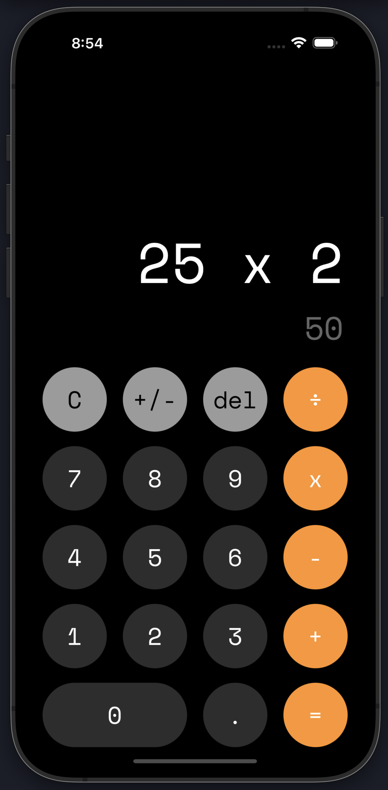

# Welcome to your Calculator app 👋

This is an [Expo](https://expo.dev) project created with [`create-expo-app`](https://www.npmjs.com/package/create-expo-app).

## Get started

1. Install dependencies

   ```bash
   npm install
   ```

2. Start the app

   ```bash
    npx expo start
   ```

   or

   ```bash
    npm start
   ```

## Descripción

Dicho proyecto tiene la finalidad de recrear una calculadora sencilla muy parecida a la de los dispositivos iOS. Dicho proyecto es compatible tanto en Android como en iOS y se trató de representar la siguiente imagen:



En este Proyecto se utilizaron componentes de expo para las fuentes, la navegación.
Se crearon estilos globales y constantes para los diferentes colores que se utilizaron en la app.

En el proyecto se crearon 2 componentes uno de los botones personalizados para poder hacer las operaciones y otro de los textos que se muestran para poder personalizarlos y que queden igual que una calculadora de iOS.

Se creo un hook personalizado donde se maneja toda la lógica de las cuentas.

## Description

This project has the purpose of recreating a simple calculator very similar to that of iOS devices. This project is compatible on both Android and iOS and we tried to represent the following image:


In this Project expo components were used for fonts, navigation.
Global and constant styles were created for the different colors used in the app.

In the project, two components were created, one of the personalized buttons to be able to carry out the operations and another of the texts that are displayed to be able to customize them and make them look the same as an iOS calculator.

A custom hook was created where all the account logic is handled.
